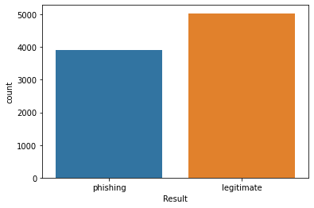
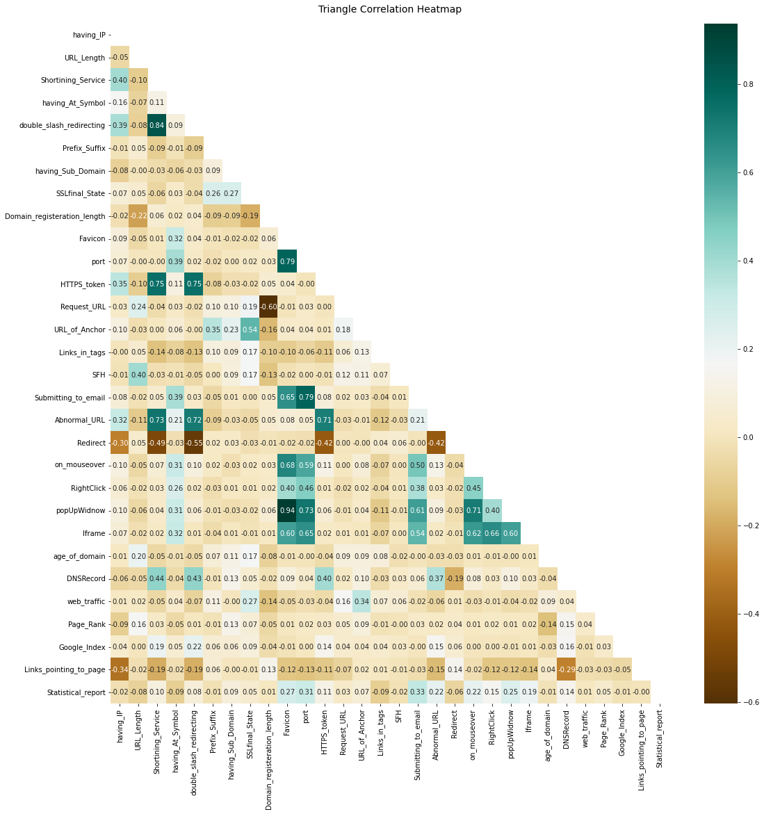
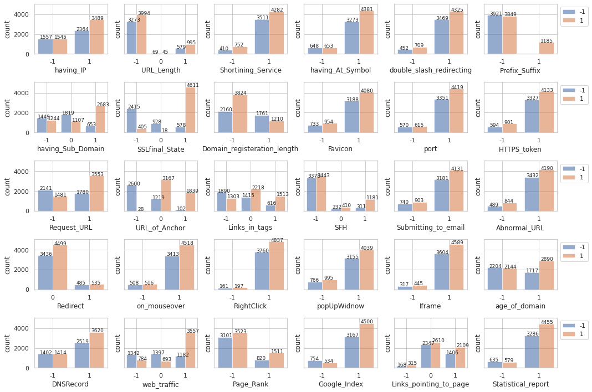

# techGig -CODE GLADIATORS- ML Problem

## Problem Satement:
Phishing Detection

## Data Description:
The data set consist of 30 features of  phishing website. The value of attributes can **[1, 0, -1]** except the key value which is incremental.
1 represents `legitimate`
0 represents `suspicious`
-1 represents `phishing`

## Result-column Value counts   

## Correlation Plots   

## Count Plots:   

